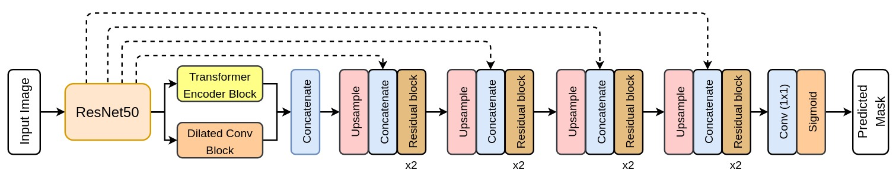
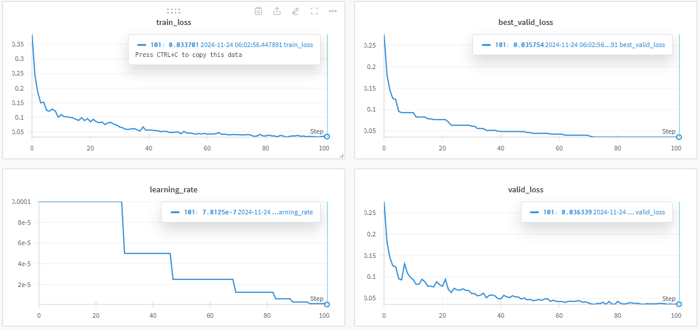

# TResUNet-Neo: Implementation of TransResUNet for colon polyp neoplasm detection and segmentation

This is my implementation of the TransResUNet architecture, modified to be able to classify neoplasic and non-neoplastic polyps on the [BKAI-IGH NeoPolyp-Small dataset](https://www.kaggle.com/competitions/bkai-igh-neopolyp/data). Detailed implementation and result can be found in [the report](report_compressed.pdf).

Original paper link: [TransResU-Net: Transformer based ResU-Net for Real-Time Colonoscopy Polyp Segmentation](https://arxiv.org/pdf/2206.08985.pdf)



Check out the original implementation of the paper [here](https://github.com/nikhilroxtomar/TransResUNet).

## Usage

### Quick testing guide

* Clone the repository:

```bash
git clone https://github.com/thanh309/tresunet-polyp-segmentation.git
cd tresunet-polyp-segmentation
```

* (Optional) Install required packgages:

```bash
pip install -r requirements.txt
```

* Download model checkpoint at [this Google Drive link](https://drive.google.com/file/d/19G2pwZO8OfPHYrXLP-2Qi8VtBDtA82NE/view?usp=sharing), and put it inside `checkpoints` folder, alongside with the `resnet50` pretrained weight. Your `checkpoints` folder should look like this afterward:

```text
checkpoints
 ├── README.md
 ├── resnet50-19c8e357.pth      # pretrained ResNet50 weights
 └── checkpoint_tres78798.pth   # model checkpoint
```

* Testing: put your polyp image to the current working directory, for example `image.jpeg`, and run the following command:

```bash
python infer.py --image_path image.jpeg
```

```bash
$ python3 infer.py --help
usage: infer.py [-h] --image_path IMAGE_PATH [--checkpoint CHECKPOINT] [--output_path OUTPUT_PATH] [--device DEVICE]

Run inference on a single image.

options:
  -h, --help            show this help message and exit
  --image_path IMAGE_PATH
                        Path to the input image.
  --checkpoint CHECKPOINT
                        Path to the trained model checkpoint. Default="checkpoints/checkpoint_tres78798.pth"
  --output_path OUTPUT_PATH
                        Path to save the segmented output image. Default="output.png"
  --device DEVICE       Device to run inference on. Default based on cuda availability
```

### Training

* Download the [BKAI-IGH NeoPolyp-Small dataset](https://www.kaggle.com/competitions/bkai-igh-neopolyp/data) and unzip.

* Edit the hyperparameters and specify the data directory in the `datapath` variable.

The training can be monitored in real-time using [Weights & Biases](https://wandb.ai/) (W&B), with plots of training loss, validation loss and best validation loss over time.



If you want to track the training process in your account, first login to W&B

```bash
wandb login
```

and provide your API key when prompted. Otherwise, comment out parts related to `wandb` in the file.

* Run the `train.py` file.

### Testing

This repository provides scripts to generate submission to the [online Kaggle competition](https://www.kaggle.com/competitions/bkai-igh-neopolyp) hosted by the dataset owners.

After getting the model checkpoint, generate mask prediction for the test set using the file `test.py`. By default, the masks are saved at `data/test_res/test_res`, and you should run this command beforehand to make the empty folder:

```bash
mkdir -p data/test_res/test_res
```

Next, run the script `mask2csv.py` to get the `csv` file that you can submit on Kaggle.

## Result

The model achieves the test Dice score of 0.78798 on the test set. Some segmentation results can be seen below.


## Acknowledgment

[1] N. Abraham and N. M. Khan. A Novel Focal Tversky Loss Function With Improved Attention U-Net for Lesion Segmentation. In 2019 IEEE 16th International Symposium on Biomedical Imaging (ISBI 2019), pages 683–687, 2019. doi: 10.1109/ISBI.2019.8759329.

[2] N. S. An, P. N. Lan, D. V. Hang, D. V. Long, T. Q. Trung, N. T. Thuy, and D. V. Sang. BlazeNeo: Blazing Fast Polyp Segmentation and Neoplasm Detection. IEEE Access, 10:43669–43684, 2022. doi: 10.1109/ACCESS.2022.3168693.

[3] N. T. Duc, N. T. Oanh, N. T. Thuy, T. M. Triet, and V. S. Dinh. ColonFormer: An Efficient Trans-former Based Method for Colon Polyp Segmentation. IEEE Access, 10:80575–80586, 2022. doi: 10.1109/ACCESS.2022.3195241.

[4] P. Ngoc Lan, N. S. An, D. V. Hang, D. V. Long, T. Q. Trung, N. T. Thuy, and D. V. Sang. NeoUnet: Towards accurate colon polyp segmentation and neoplasm detection. In G. Bebis, V. Athitsos, T. Yan, M. Lau, F. Li, C. Shi, X. Yuan, C. Mousas, and G. Bruder, editors, Advances in Visual Computing, Cham, 2021. Springer International Publishing. ISBN 978-3-030-90436-4.

[5] N. H. Thuan, N. T. Oanh, N. T. Thuy, S. Perry, and D. V. Sang. RaBiT: An Efficient Transformer using Bidirectional Feature Pyramid Network with Reverse Attention for Colon Polyp Segmentation, 2023. [URL](https://arxiv.org/abs/2307.06420).

[6] N. K. Tomar, A. Shergill, B. Rieders, U. Bagci, and D. Jha. TransResU-Net: Transformer based ResU-Net for Real-Time Colonoscopy Polyp Segmentation, 2022. [URL](https://arxiv.org/abs/2206.08985).
